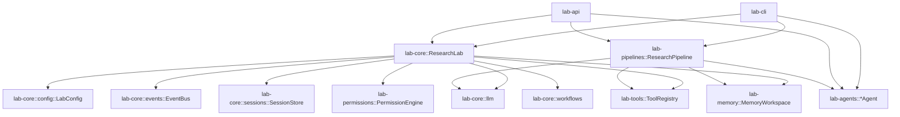
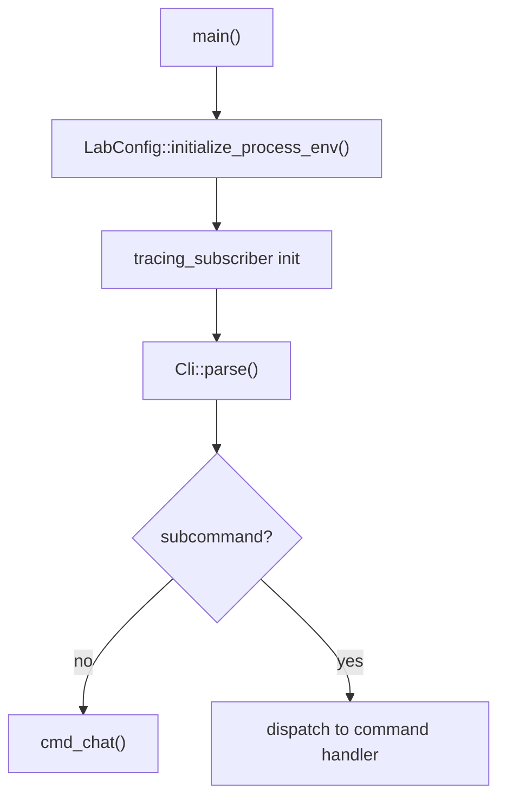
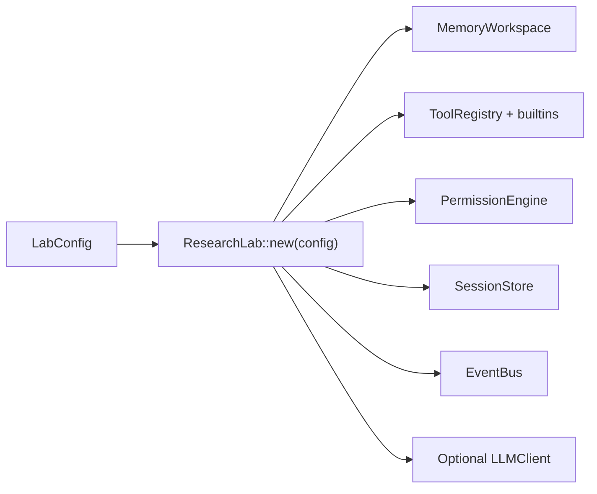
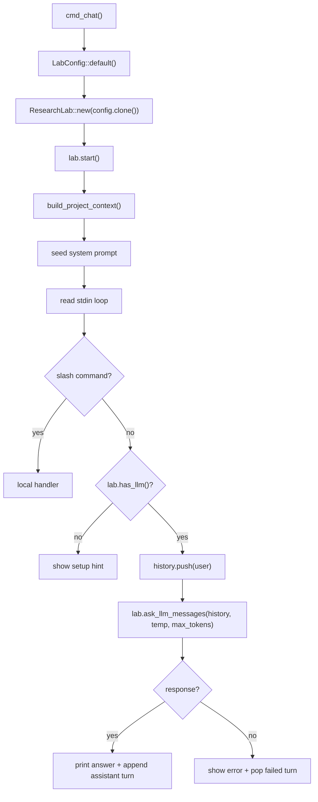
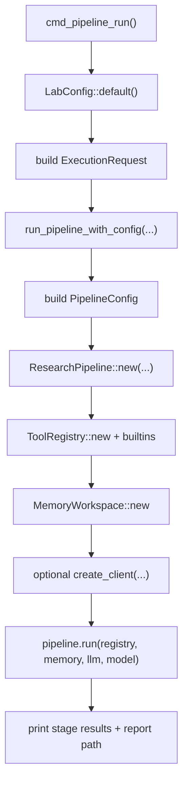
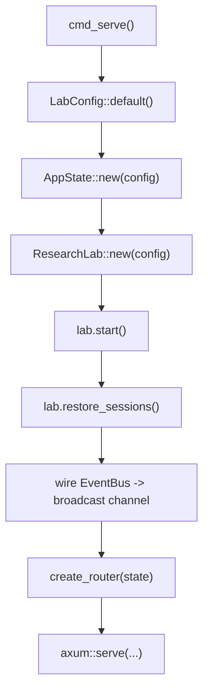
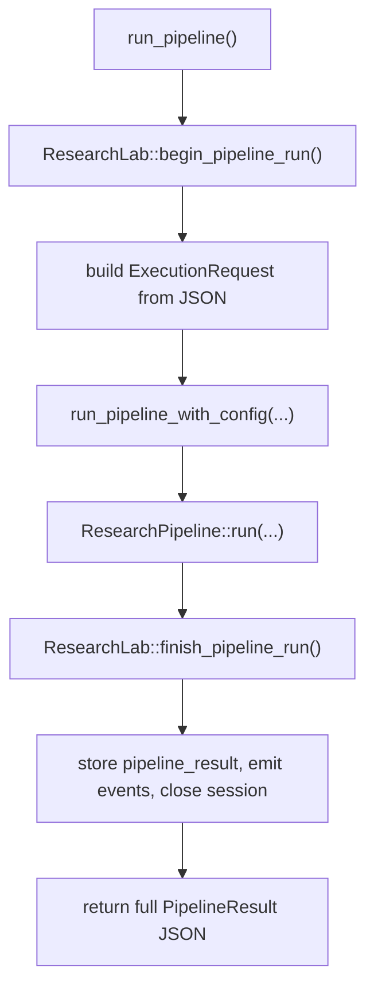
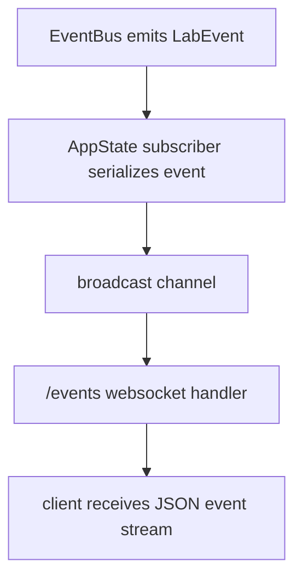
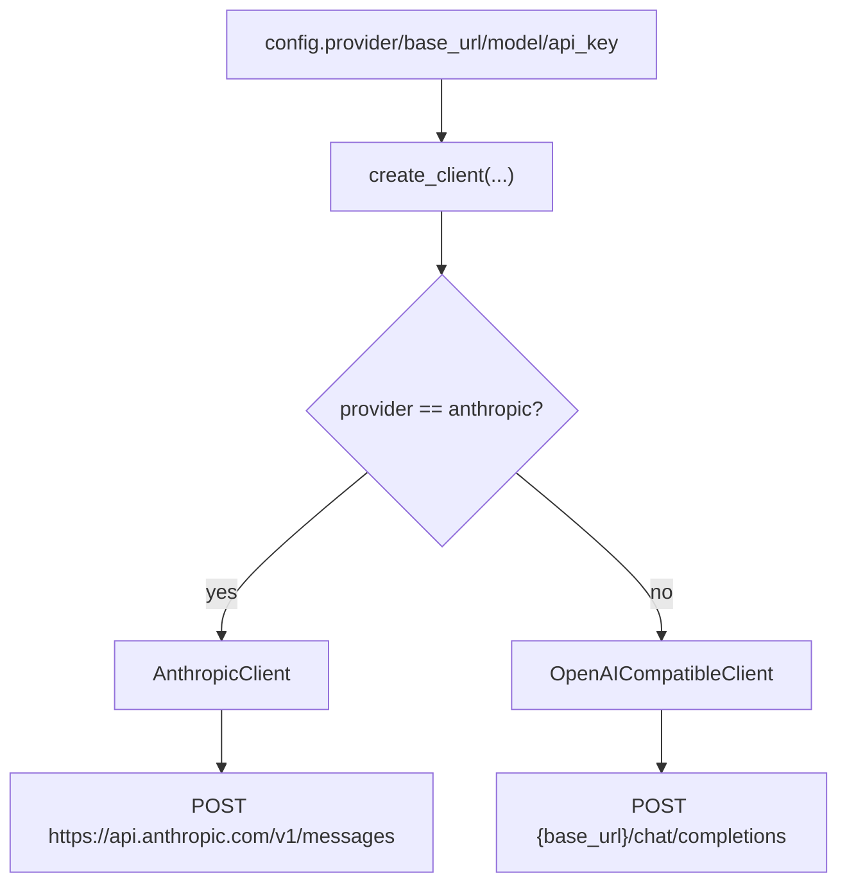
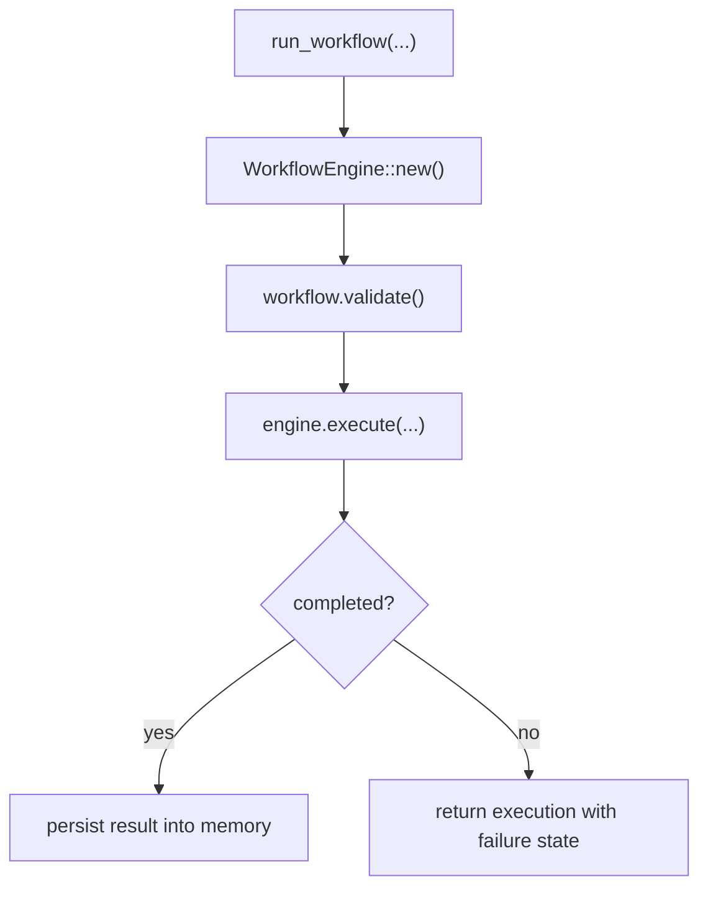

# AI Research Lab Runtime Map

This document maps the code that currently runs in the Rust workspace.
Unlike `DESIGN.md`, which includes planned and parity-target architecture, this file is implementation-first:

- what the binary actually does today
- where commands enter the system
- which subsystems are wired through `lab-core`
- where the CLI still shortcuts directly into sibling crates

## 1. Dependency Graph

The runtime shape is still a DAG, but there are two important execution styles:

1. `lab-core` as the shared orchestrator
2. direct CLI composition for richer command behavior

## 2. Bootstrap Flow

The binary starts in `crates/lab-cli/src/main.rs`.

### What happens during env bootstrap

- `LabConfig::initialize_process_env()` loads `.env` once per process.
- If `LAB_WORKSPACE` is set, it also tries `<workspace>/.env`.
- `LabConfig::default()` then applies provider/model/base URL/API key resolution.
- Directory roots are created during config setup.

Key implementation points:

- `crates/lab-core/src/config.rs`
- `LabConfig::initialize_process_env()`
- `LabConfig::default()`
- `LabConfig::apply_env_overrides()`

## 3. Core Wiring

`ResearchLab` is the main runtime container.

At construction time, `ResearchLab::new` does the following:

1. Resolves workspace-relative directories from config.
2. Builds memory storage.
3. Builds the tool registry and registers built-in tools.
4. Builds the permission engine.
5. Builds the session store.
6. Creates the event bus.
7. Creates an LLM client if config says the provider is usable.

That means config is the true root of runtime behavior:

- provider
- model
- base URL
- keyless local mode vs keyed remote mode
- workspace path layout

## 4. Command Flow

## Interactive Chat

Source: `crates/lab-cli/src/main.rs`

Behavior notes:

- `/help`, `/status`, `/pipeline`, `/clear`, `/exit` are handled in the CLI loop, not through a central command registry.
- chat history is held in memory only for the current interactive session.
- `build_project_context()` currently snapshots `Cargo.toml`, `DESIGN.md`, `RUNTIME_MAP.md`, and `README.md` when present.

## `lab ask`

This is the single-shot LLM path.

1. Build config.
2. Build a `ResearchLab`.
3. Refuse if no LLM is configured.
4. Build one system message and one user message.
5. Call `ask_llm_messages`.

This reuses the same LLM stack as interactive chat, but skips the rolling REPL state.

## `lab pipeline`

This command now uses the shared pipeline runtime in `lab-pipelines`.

The important detail is that the CLI and API now share the same pipeline assembly code:

- `ExecutionRequest` decides stages, targets, and output path
- `run_pipeline_with_config` builds tools, memory, LLM, and `ResearchPipeline`

## `lab agent`

This is another direct composition path.

1. Build config.
2. Build tool registry and memory.
3. Optionally build an LLM client.
4. Instantiate one concrete agent directly.
5. Call that agent’s `execute(...)`.

The CLI currently chooses:

- `ResearcherAgent`
- `ReviewerAgent`
- `SummarizerAgent`

That means concrete agents are not yet centrally spawned by `ResearchLab`; the CLI is acting as the composition root for those command paths.

## `lab serve`

This path moves into the HTTP server stack:

## 5. API Flow

`lab-api` is stateful. It wraps one `ResearchLab` inside `AppState`.

### Shared state

- `RwLock<ResearchLab>` for mutable lab access
- `broadcast::Sender<String>` for WebSocket fan-out

### Main routes

- `GET /health`
- `POST /sessions`
- `GET /sessions`
- `GET /sessions/{id}`
- `DELETE /sessions/{id}`
- `GET /tools`
- `POST /tools/execute`
- `GET /memory/{session_id}`
- `POST /memory`
- `GET /memory/{session_id}/search`
- `POST /agents/run`
- `POST /ask`
- `GET /stats`
- `GET /events`
- `GET /events/history`
- `POST /pipelines/run`
- `POST /workflows/run`

### `POST /pipelines/run`

This route now mirrors the CLI pipeline path instead of calling the old placeholder.

### WebSocket flow

## 6. LLM Flow

All LLM calls funnel through `lab-core/src/llm/client.rs`.

### Resolution rules

- provider-specific env vars are preferred over generic `LAB_API_KEY`
- local mode is treated as keyless-capable
- non-Anthropic providers use the OpenAI-compatible transport
- OpenAI-compatible requests retry on `429`

## 7. Session, Tool, Memory, and Permission Flow

These are mediated by `ResearchLab`.

### Sessions

- `create_session` creates a new `LabSession`
- `close_session` persists it through `SessionStore`
- `restore_sessions` rehydrates active sessions from disk on server startup

### Tools

Tool calls go through:

1. optional permission check
2. operation counters
3. `ToolRegistry::execute`

That flow is implemented in `ResearchLab::execute_tool`.

### Memory

Memory is workspace-scoped and available through:

- `memory()`
- `memory_mut()`

Agents, workflows, and API handlers all write results there so the lab can query them later.

## 8. Workflow Flow

Workflows are routed through `lab-core::workflows`.

There is also a template path:

- build `TemplateRegistry`
- register built-ins
- instantiate a workflow by template name
- run through the same engine

## 9. Current Architectural Truths

The cleanest way to understand the repo right now is:

### What is centralized

- config loading
- LLM transport
- sessions
- memory
- tool execution
- permission checks
- event emission
- workflow execution

### What is still split

- pipeline execution is real but lives in `lab-pipelines`
- concrete agent command execution is real but composed directly in `lab-cli`
- `ResearchLab` still owns pipeline session bookkeeping, memory indexing, and event emission
- `ResearchLab::run_pipeline()` remains a legacy lightweight method; the CLI and API both use `run_pipeline_with_config(...)` for real stage execution

## 10. Command-to-Code Index

| User action | Entry point | Main runtime path |
|---|---|---|
| `lab` | `cmd_chat()` | CLI REPL -> `ResearchLab` -> `ask_llm_messages()` |
| `lab ask` | `cmd_ask_once()` | single-shot LLM call through `ResearchLab` |
| `lab pipeline` | `cmd_pipeline_run()` | `ExecutionRequest` -> `run_pipeline_with_config()` -> `ResearchPipeline::run()` |
| `lab agent` | `cmd_agent()` | direct concrete agent `execute(...)` |
| `lab serve` | `cmd_serve()` | `AppState::new()` -> router -> Axum |
| `lab setup` | `cmd_setup()` | interactive `.env` write path |
| API `/ask` | `ask_llm()` | shared `ResearchLab` LLM path |
| API `/pipelines/run` | `run_pipeline()` | `ResearchLab::begin_pipeline_run()` -> `run_pipeline_with_config()` -> `ResearchLab::finish_pipeline_run()` |
| API `/agents/run` | `run_agent()` | server-side concrete agent execution |
| API `/events` | `ws_events()` | `EventBus` -> broadcast -> websocket |

## 11. File Anchors

- CLI entry and command routing: `crates/lab-cli/src/main.rs`
- Shared config resolution: `crates/lab-core/src/config.rs`
- Core orchestrator: `crates/lab-core/src/engine.rs`
- LLM transport: `crates/lab-core/src/llm/client.rs`
- HTTP and WebSocket server: `crates/lab-api/src/lib.rs`
- Pipeline executor: `crates/lab-pipelines/src/lib.rs`

## 12. Recommended Reading Order

If someone new is onboarding to the repo, the fastest accurate path is:

1. `crates/lab-cli/src/main.rs`
2. `crates/lab-core/src/config.rs`
3. `crates/lab-core/src/engine.rs`
4. `crates/lab-core/src/llm/client.rs`
5. `crates/lab-pipelines/src/lib.rs`
6. `crates/lab-api/src/lib.rs`

That sequence mirrors the real runtime stack from command entry to subsystem wiring.
